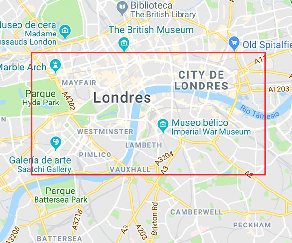
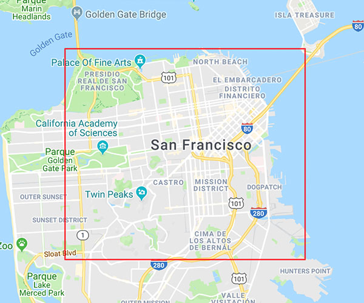

# Destination Content testing coordinates

The following cities are supported by Points of Interest, Safe Places and Tours and Activities under Testing environment.

## Bangalore

 Latitude North: 13.023577, Longitude West: 77.536856, Latitude South: 12.923210, Longitude East: 77.642256 

 

## Barcelona

 Latitude North: 41.42, Longitude West: 2.11, Latitude South: 41.347463, Longitude East: 2.228208 

 

## Berlin

 Latitude North: 52.541755, Longitude West: 13.354201, Latitude South: 52.490569, Longitude East: 13.457198 

 

## Dallas

 Latitude North: 32.806993, Longitude West: -96.836857, Latitude South: 32.740310, Longitude East: -96.737293 

 

## London

 Latitude North: 51.520180, Longitude West: -0.169882, Latitude South: 51.484703, Longitude East: -0.061048 

 

## New York

 Latitude North: 40.792027, Longitude West: -74.058204, Latitude South: 40.697607, Longitude East: -73.942847 

 

## Paris

 Latitude North: 48.91, Longitude West: 2.25, Latitude South: 48.80, Longitude East: 2.46 

 

## San Francisco

 Latitude North: 37.810980, Longitude West: -122.483716, Latitude South: 37.732007, Longitude East: -122.370076 

 
